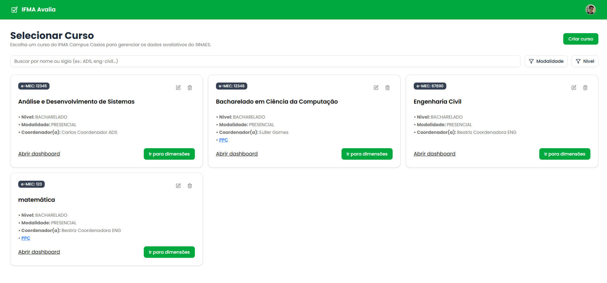
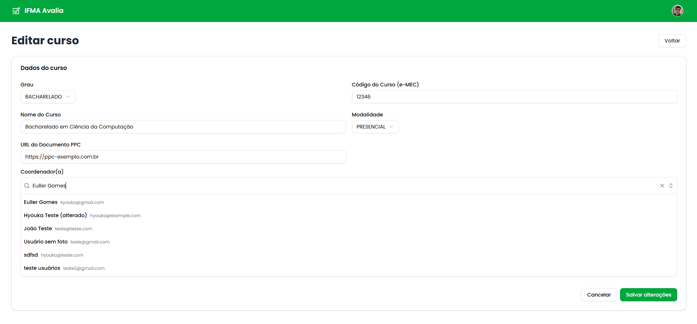
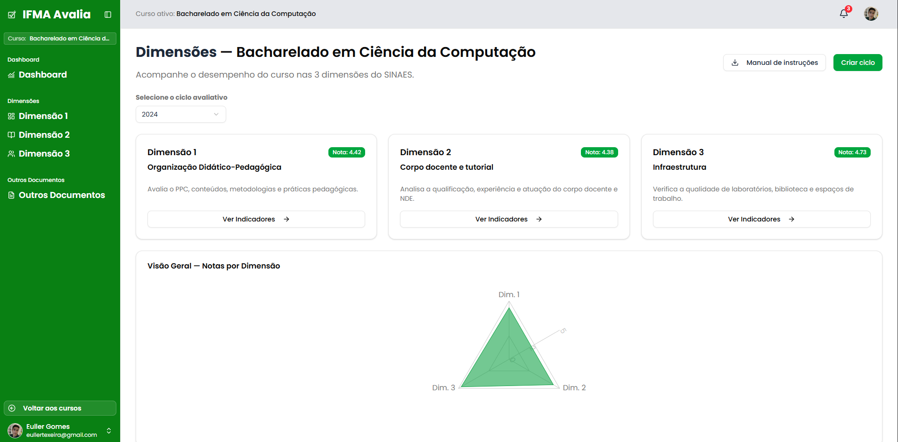
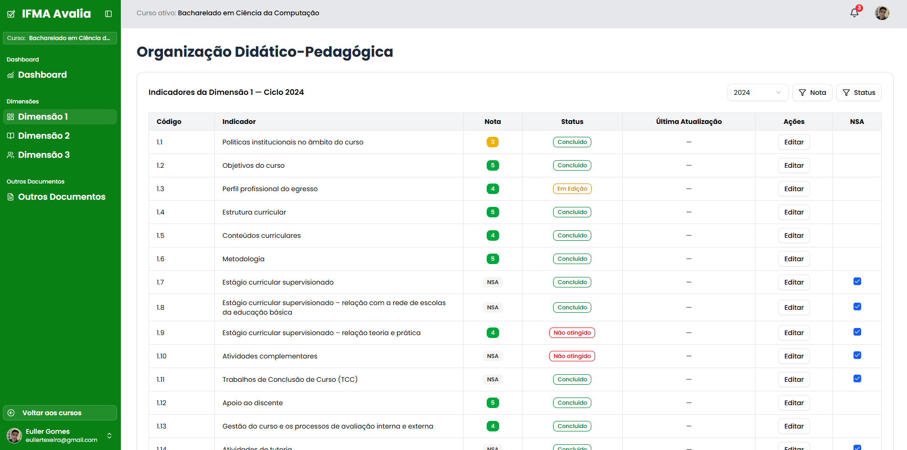
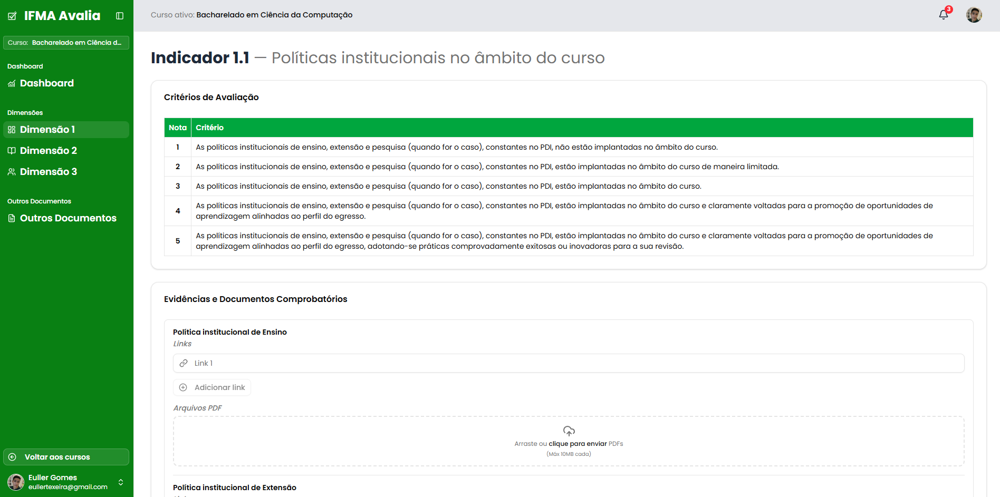

<div align="center">


<h1>Plataforma de Monitoramento SINAES</h1>

<p>
Plataforma web robusta para monitoramento estratégico dos indicadores de avaliação do SINAES para o IFMA Campus Caxias.
</p>

<p>
<strong>Projeto de Trabalho de Conclusão de Curso (TCC)</strong><br/>
Bacharelado em Ciência da Computação – IFMA
</p>

<p>

</p>

</div>

---

## 🧭 1. Sobre o Projeto

Esta plataforma é uma solução completa para **gerenciar e monitorar os indicadores do SINAES (Sistema Nacional de Avaliação da Educação Superior)**.

O objetivo é substituir processos manuais e planilhas fragmentadas por um sistema centralizado, dinâmico e seguro, permitindo transformar dados brutos em **inteligência estratégica**.

A plataforma está sendo desenvolvida por **Euller Gomes Teixeira**, como requisito parcial para obtenção do grau de **Bacharel em Ciência da Computação**.

Atualmente, o sistema encontra-se em fase de validação institucional, sendo testado e aprimorado para uso externo dentro do Campus Caxias.
Após a conclusão dessa etapa, sua replicabilidade será avaliada para possível implantação em outros campi e unidades do Instituto Federal do Maranhão, consolidando-se como uma ferramenta unificada para o monitoramento estratégico dos indicadores do SINAES em todo o estado.

### Objetivos principais:

- Acompanhar o desempenho histórico dos cursos.
- Identificar pontos críticos e oportunidades de melhoria.
- Gerenciar planos de ação para indicadores com notas baixas.
- Centralizar evidências e documentos comprobatórios exigidos pelo MEC/INEP.
- Fortalecer a cultura de **avaliação contínua** e **tomada de decisão baseada em dados**.

---

## ⚙️ 2. Funcionalidades Principais

A plataforma está sendo desenvolvida com múltiplos níveis de acesso, garantindo segurança e clareza no uso:

### 👥 Visão Pública (Visitante)
- Visualização transparente dos cursos e seus indicadores avaliativos.

### 🎓 Visão do Coordenador de Curso
- Gerenciamento de **Ciclos de Avaliação** (2024, 2025, ...).  
- Preenchimento e atualização dos **Indicadores** (Nota, Status, Plano de Ação).  
- Controle de aplicabilidade (**NSA – Não Se Aplica**).  
- Upload e reutilização de **Evidências** (PDFs e links de nuvem).

### 🏫 Visão da Direção
- CRUD completo de **Cursos**.  
- Associação de **Coordenadores** aos cursos.  
- Painel com **visão geral de desempenho institucional**.

### 🧩 Visão do Administrador (Admin)

- Controle global sobre os Ciclos Avaliativos de todos os cursos.
- Definição e abertura de novos ciclos institucionais (ex: “Avaliação 2025”).
- Encerramento de ciclos e bloqueio de edições após o período de coleta.
- Supervisão geral dos usuários e permissões do sistema.
- Acesso completo aos dados para fins de auditoria e gestão institucional.

---

## 🧩 3. Stack Tecnológico

| Categoria | Tecnologia | Justificativa |
|------------|-------------|---------------|
| **Framework Full-Stack** | [Next.js (App Router)](https://nextjs.org/) | Renderização no Servidor (SSR), Server Components e Server Actions para performance e segurança. |
| **Linguagem** | [TypeScript](https://www.typescriptlang.org/) | Segurança de tipos e robustez em todo o projeto. |
| **Banco de Dados** | [MongoDB Atlas](https://www.mongodb.com/atlas) | Banco NoSQL ideal para estrutura de documentos aninhados. |
| **ORM** | [Prisma ORM](https://www.prisma.io/) | Consultas seguras, tipadas e performáticas. |
| **Autenticação** | [Better Auth](https://www.better-auth.com/) | Integração com Prisma Adapter para autenticação e sessões. |
| **UI & Estilização** | [Tailwind CSS](https://tailwindcss.com/) + [Shadcn/ui](https://ui.shadcn.com/) | Interface moderna, responsiva e acessível. |
| **Validação** | [Zod](https://zod.dev/) | Validação de schemas compartilhada entre client e server. |
| **Armazenamento de Arquivos** | [Cloudinary](https://cloudinary.com/) | Upload e entrega otimizada de mídias e PDFs. |
| **Ambiente Local** | [Docker](https://www.docker.com/) | Containerização do MongoDB para desenvolvimento consistente. |

---

## 🖼️ 4. Screenshots

<div align="center">

### Página dos Cursos  


### Página de Edição do Curso  


### Página das Dimensões  


### Página da Dimensão  


### Página do Indicador  


### Página de Login  


</div>

---

## 🏗️ 5. Arquitetura da Solução

O projeto segue as práticas modernas do **Next.js (App Router)**:

- **App Router:** estrutura de rotas baseada em pastas.  
- **Server Components:** páginas renderizadas no servidor (`/courses`, `/dimensions`) com dados via Prisma.  
- **Client Components:** usados apenas para interatividade (`<form>`, filtros, uploads).  
- **Server Actions:** lógica de mutação e validação Zod diretamente no servidor.  
- **API Routes:** utilizadas em buscas dinâmicas, upload para o storage, etc.

---

## 🚀 6. Como Executar Localmente

### 🔧 Pré-requisitos

- [Node.js (v18+)](https://nodejs.org/)
- npm ou yarn
- [Docker + Docker Compose](https://www.docker.com/)

---

### 🌀 1. Clonar o Repositório

```bash
git clone https://github.com/eullergomes/sinaes-platform.git
cd sinaes-platform
```

### 📦 2. Instalar Dependências
```bash
npm install
```

### ⚙️ 3. Configurar Variáveis de Ambiente

Crie um arquivo `.env` na raiz do projeto, baseado no `.env.example`:
```bash
# URL do Banco de Dados (local ou Atlas)
DATABASE_URL="mongodb://localhost:27017/sinaes_db_local?replicaSet=rs0"

# Secret de autenticação
AUTH_SECRET="SEU_AUTH_SECRET_FORTE"

# Credenciais Cloudinary
CLOUDINARY_URL="cloudinary://<API_KEY>:<API_SECRET>@<CLOUD_NAME>"
CLOUDINARY_CLOUD_NAME="SEU_CLOUD_NAME"
CLOUDINARY_API_KEY="SUA_API_KEY"
CLOUDINARY_API_SECRET="SUA_API_SECRET"
```
### 🐳 4. Iniciar o Banco de Dados com Docker
```bash
# Sobe o container MongoDB em modo replica set (necessário para o Prisma)
docker-compose up -d
```

Na primeira execução, configure o replica set:
```bash
docker exec -it mongodb_local mongosh
```

Dentro do shell:
```bash
rs.initiate({ _id: "rs0", members: [{ _id: 0, host: "localhost:27017" }] })
exit
```

### 🗄️ 5. Sincronizar e Popular o Banco
```bash
# Aplica o schema do Prisma
npx prisma db push

# Gera o cliente Prisma
npx prisma generate

# (Opcional) Popula com dados de teste
npx prisma db seed
```

### 💻 6. Rodar a Aplicação
```bash
npm run dev
```

### 📚 7. Autor

👨‍💻 **Euller Gomes Teixeira**

Bacharelado em Ciência da Computação – IFMA Campus Caxias

[LinkedIn](https://www.linkedin.com/in/eullergomes)

[Repositório GitHub](https://github.com/eullergomes/sinaes-platform)

### 🪪 Licença

Este software é de uso interno do Instituto Federal do Maranhão (IFMA) – Campus Caxias.

Sua reprodução, modificação ou redistribuição fora do âmbito institucional requer autorização expressa do autor e da instituição.

© 2025 Euller Gomes Teixeira. Todos os direitos reservados.


<div align="center"> Feito com 💚 por <strong>Euller Gomes Teixeira</strong> </div>